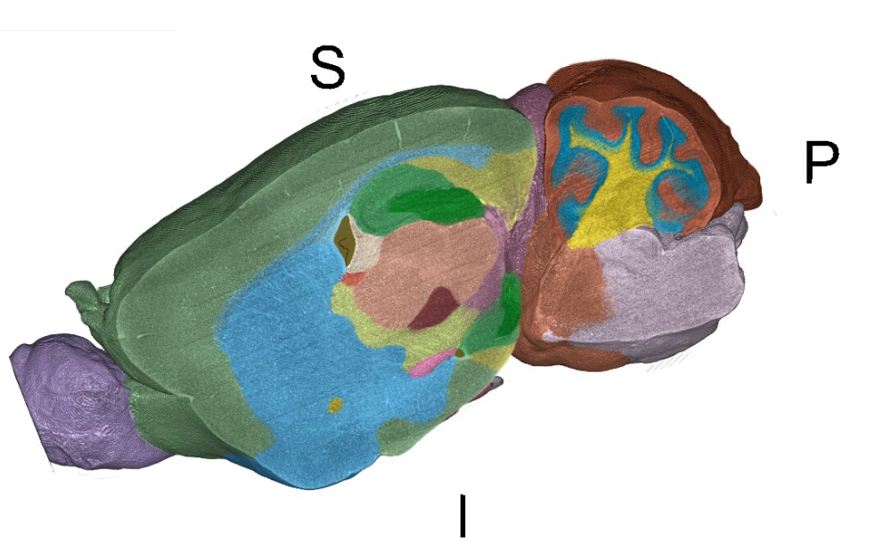
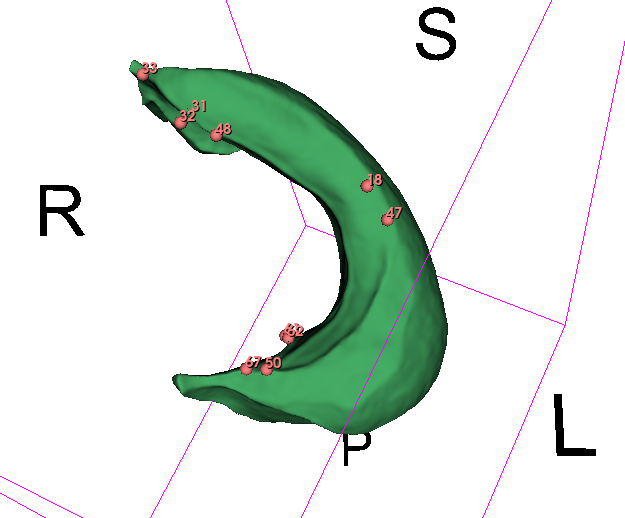
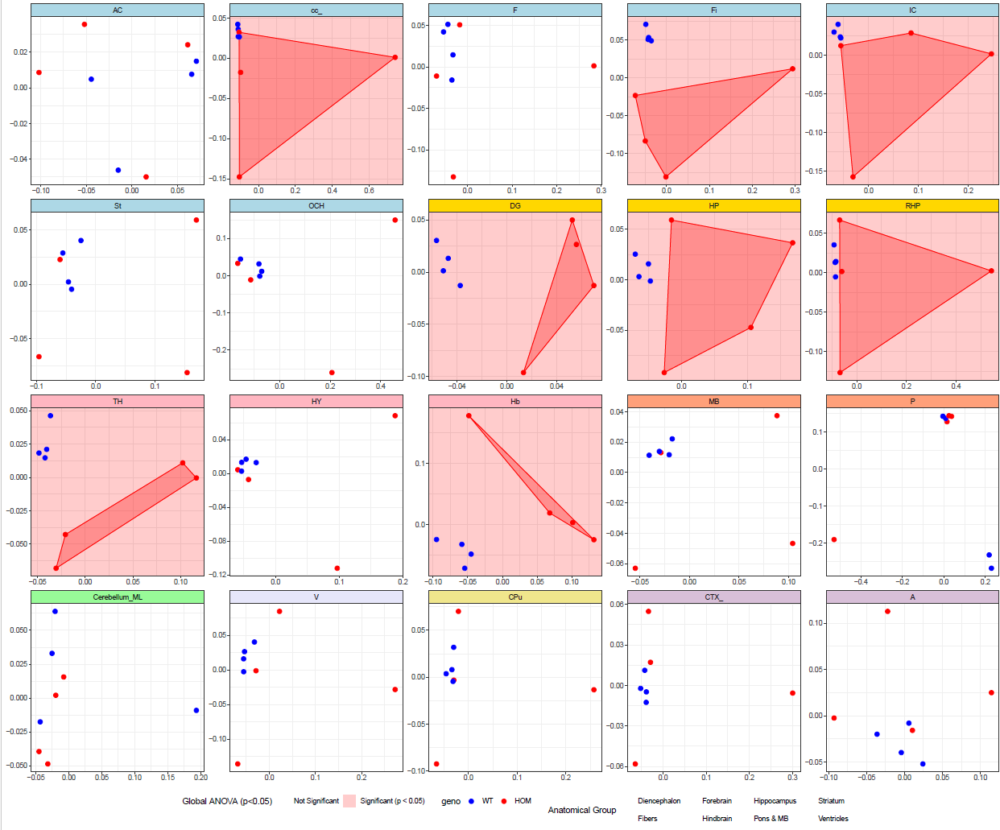

# Mouse Brain 3D Morphometric Analysis Pipeline

> **Companion repository for ICPR 2026 paper #564**  
> *"Automatic Segmentation for 3D Morphometric Analysis of the Mouse Brain"*

This repository provides a fully reproducible three-stage pipeline for automated 3D morphometric analysis of the mouse brain:

1. **Segmentation** — nnU-Net predicts anatomical regions from `.nrrd` MRI volumes
2. **Landmark Placement** — ALPACA registers template landmarks onto each segmented region
3. **Statistical Analysis** — Geometric Morphometrics (GPA + PCA + ANOVA + LDA) in R

---

## Table of Contents

- [Repository Structure](#repository-structure)
- [Hardware & Software Requirements](#hardware--software-requirements)
- [Quick Start](#quick-start)
- [Stage 1 — Segmentation with nnU-Net](#stage-1--segmentation-with-nn-u-net)
- [Stage 2 — Landmark Placement with ALPACA](#stage-2--landmark-placement-with-alpaca)
- [Stage 3 — Statistical Analysis in R](#stage-3--statistical-analysis-in-r)
- [Data Format Reference](#data-format-reference)
- [Reproducing Paper Results](#reproducing-paper-results)
- [Troubleshooting](#troubleshooting)
- [Citation](#citation)

---

## Repository Structure

```
ngmm-pipeline/
│
├── README.md                          ← This file
│
├── 1_segmentation/                    ← Stage 1: nnU-Net segmentation
│   ├── run_segmentation.sh            ← Main pipeline script
│   ├── prediction/
│   │   ├── File_name_new.py           ← Renames input files for nnU-Net convention
│   │   ├── Conversion_to_nifti.py     ← Converts .nrrd → NIfTI (.nii.gz)
│   │   ├── Conversion_to_nrrd.py      ← Converts nnU-Net output → .seg.nrrd
│   │   └── Remove_outside_voxels.py   ← Masks predictions to brain volume
│   └── dataset.json                   ← nnU-Net label map (region names ↔ IDs)
│   └── NG4990_Segments.seg.nrrd       ← template of label order for saving predicted output of nnU-Net
│
├── 2_landmark_placement/              ← Stage 2: ALPACA in 3D Slicer
│   ├── run_alpaca_pipeline.py         ← ALPACA multiprocess script (run inside Slicer)
│   ├── template_model/                ← Template surface meshes (.vtk), one per region
│   │   ├── DG/  CC/  HP/  ...
│   ├── template_landmarks/            ← Template landmark files (.mrk.json), one per region
│   │   ├── DG/  CC/  HP/  ...
│   └── convert_seg_to_vtk/
│       └── seg_nrrd_to_vtk.py         ← Converts .seg.nrrd → per-region .vtk files
│
├── 3_morphometrics/                   ← Stage 3: R statistical analysis
│   └── gpa_pca_analysis.R             ← Full GPA + PCA + ANOVA + LDA script
│
├── config/
│   └── paths_template.sh              ← Centralised path configuration (edit before running)
│
└── docs/
    ├── data_format.md                 ← File naming conventions and format specs
    └── environment_setup.md           ← Detailed environment setup instructions
```

---

## Hardware & Software Requirements

### Minimum Hardware
| Component | Requirement |
|-----------|-------------|
| GPU | NVIDIA GPU with ≥ 8 GB VRAM (CUDA 11.8) |
| RAM | ≥ 32 GB system RAM |
| Storage | ≥ 50 GB free disk space |

> **Note:** Stage 1 (nnU-Net inference) was run on a shared HPC cluster. Stage 2 (ALPACA) and Stage 3 (R) can run on a standard workstation without a GPU.

### Software Stack

| Tool | Version | Purpose |
|------|---------|---------|
| Python | 3.11.13 | Stages 1 & 2 |
| nnU-Net v2 | 2.6.0 | Segmentation |
| 3D Slicer | 5.10.0 | ALPACA landmark placement |
| ALPACA (Slicer extension) | latest | Landmark registration |
| R | 4.5.2 | Statistical analysis |
| CUDA | 11.8 | GPU inference |
| Conda | any | Environment management |

---

## Quick Start

```bash
# 1. Clone this repository
git clone https://github.com/YOUR_USERNAME/ngmm-pipeline.git
cd ngmm-pipeline

# 2. Configure your paths
cp config/paths_template.sh config/paths.sh
nano config/paths.sh          # Edit all paths to match your system

# 3. Set up the Python environment (see Stage 1 setup below)
conda create -n env_ng python=3.11.13 pytorch==2.6.0 pytorch-cuda=11.8 -c pytorch -c nvidia
conda activate env_ng
pip install -r path/to/ngmm-pipeline/docs/requirements.txt

# 4. Run the full segmentation pipeline
bash 1_segmentation/run_segmentation.sh #[OPTIONAL: NG4975 NG4976 ...]

# 5. Convert segmentations to .vtk for ALPACA (see Stage 2)
python 2_landmark_placement/convert_seg_to_vtk/seg_nrrd_to_vtk.py

# 6. Run ALPACA inside 3D Slicer (see Stage 2)

# 7. Run the R analysis (see Stage 3)
Rscript 3_morphometrics/gpa_pca_analysis.R
```

---

## Stage 1 — Segmentation with nnU-Net

### Overview

The script `1_segmentation/run_segmentation.sh` runs a 4-step prediction pipeline:

| Step | Script | What it does |
|------|--------|--------------|
| 1 | `File_name_new.py` | Renames raw `.nrrd` files to nnU-Net's `_0000` suffix convention |
| 2 | `Conversion_to_nifti.py` | Converts renamed `.nrrd` → `.nii.gz` (NIfTI format required by nnU-Net) |
| 3 | `nnUNetv2_predict` | Runs ensemble inference across 5 folds (`-f 0 1 2 3 4`) |
| 4 | `Conversion_to_nrrd.py` | Converts predicted NIfTI labels → `.seg.nrrd` (3D Slicer compatible) |
| 5 | `Remove_outside_voxels.py` | Removes predicted voxels outside the brain mask |

### Setup

```bash
# Create and activate the conda environment
conda create -n env_ng python=3.11.13 pytorch==2.6.0 pytorch-cuda=11.8 -c pytorch -c nvidia
conda activate env_ng
pip install -r path/to/ngmm-pipeline/docs/requirements.txt

# Set nnU-Net environment variables (or add to your .bashrc)
export nnUNet_raw=/path/to/ngmm-pipeline/nnUNet_raw_data
export nnUNet_preprocessed=/path/to/ngmm-pipeline/nnUNet_preprocessed
export nnUNet_results=/path/to/ngmm-pipeline/nnUNet_results
```

### Input Data Requirements

Create input folder with the bash command of:

```bash
bash mkdir -p /path/to/ngmm-pipeline/pipeline_data/processed_files_3
```

Place your raw MRI volumes in the `processed_files_3/` folder. Each sample must have a file matching the pattern:

```
{SAMPLE_ID}_RCL5_masked.nrrd
```

Example:
```
processed_files_3/
├── NG4975_RCL5_masked.nrrd
├── NG4976_RCL5_masked.nrrd
└── ...
```

### Running the Segmentation

```bash
# Option A: Process all new samples automatically (skips already-processed ones)
bash 1_segmentation/run_segmentation.sh

# Option B: Process specific samples by name
bash 1_segmentation/run_segmentation.sh NG4975 NG4976 NG4977
```

The script automatically detects which sample IDs already have outputs in `output_dir/` and skips them — making it safe to re-run incrementally.

### Expected Outputs

After running, outputs appear in the configured `output_dir/`:

```
segmentation_predictions/
├── NG4975_RCL5.seg.nrrd    ← Multi-label segmentation (all regions)
├── NG4976_RCL5.seg.nrrd
└── ...
```

Each `.seg.nrrd` file contains all segmented anatomical regions encoded as integer labels defined in `dataset.json`.



---

## Stage 2 — Landmark Placement with ALPACA

### Overview

ALPACA (Automated Landmarking through Pointcloud Alignment and Correspondence Analysis) transfers landmarks from a template brain to each target brain by:

1. Registering the template surface to the target via RANSAC + ICP
2. Propagating landmarks using Coherent Point Drift (CPD)

This stage has two sub-steps:

**2a.** Convert `.seg.nrrd` → per-region `.vtk` surface meshes  
**2b.** Run ALPACA inside 3D Slicer to place landmarks

### 2a — Convert Segmentations to VTK Surfaces

After Stage 1, each sample has a single `.seg.nrrd` file containing all segments. You must extract each region as a separate `.vtk` surface file, organised by region:

```
target_models/
├── DG/
│   ├── NG4975_DG.vtk
│   ├── NG4976_DG.vtk
│   └── ...
├── HP/
│   ├── NG4975_HP.vtk
│   └── ...
└── CC/
    └── ...
```

Run:
```bash
python 2_landmark_placement/convert_seg_to_vtk/seg_nrrd_to_vtk.py \
    --input_dir /path/to/segmentation_predictions/ \
    --output_dir /path/to/target_models/ \
    --label_map 1_segmentation/dataset.json
```

> **How it works:** The script reads `dataset.json` to map integer label IDs to region names (e.g., label `3` → `"DG"`), then marching-cubes extracts each label as a `.vtk` surface mesh and saves it to `{REGION_NAME}/{SAMPLE_ID}_{REGION_NAME}.vtk`.

### 2b — Run ALPACA Inside 3D Slicer

ALPACA must be run inside the 3D Slicer Python environment.

**Prerequisites:**
1. Install [3D Slicer 5.6+](https://download.slicer.org/)
2. Install the **SlicerMorph** extension (includes ALPACA) via Slicer's Extension Manager
3. Prepare one template per region in `template_model/{REGION}/` and `template_landmarks/{REGION}/`

**Running the script:**

1. Open 3D Slicer
2. Open the Python Interactor (`View → Python Interactor`)
3. Run:

```python
exec(open("/path/to/2_landmark_placement/run_alpaca_pipeline.py").read())
```

Or use the Slicer scripted module runner.

**Key parameters** (edit at top of `run_alpaca_pipeline.py`):

```python
BASE   = "/path/to/alpaca_run"      # Root directory
REGION = "DG"                        # Region to process (or loop over regions)
```

**ALPACA parameters used in this study:**

| Parameter | Value | Description |
|-----------|-------|-------------|
| `projectionFactor` | 0.01 | Point projection factor |
| `pointDensity` | 1.5 | Surface sampling density |
| `normalSearchRadius` | 2.0 | Normal estimation neighbourhood |
| `FPFHNeighbors` | 100 | Feature descriptor neighbours |
| `FPFHSearchRadius` | 5.0 | Feature search radius (mm) |
| `distanceThreshold` | 3.0 | RANSAC inlier threshold (mm) |
| `maxRANSAC` | 1,000,000 | Max RANSAC iterations |
| `ICPDistanceThreshold` | 1.5 | ICP refinement threshold (mm) |
| `alpha` | 2.0 | CPD regularisation |
| `beta` | 2.0 | CPD motion coherence |
| `CPDIterations` | 100 | CPD max iterations |
| `CPDTolerance` | 0.001 | CPD convergence tolerance |

### Expected Outputs

```
alpaca_run/
└── output/
    └── DG/
        └── individualEstimates/
            ├── NG4975_RCL5_DG_template.mrk.json
            ├── NG4976_RCL5_DG_template.mrk.json
            └── ...
```

The script also writes `ALPACA_RMSE_summary.csv` with per-subject RMSE against any available ground-truth landmarks and total runtime.


---

## Stage 3 — Statistical Analysis in R

### Overview

The R script `3_morphometrics/gpa_pca_analysis.R` processes landmark files from all regions and produces:

- Generalised Procrustes Analysis (GPA) aligned coordinates
- PCA of shape space with variance explained
- Outlier detection (Mean + 2×SD threshold)
- Procrustes ANOVA with permutation (RRPP, 999 iterations)
- Pairwise group comparisons
- Cross-validated LDA with permutation test (1000 iterations)
- Multi-panel matrix plots (PDF) across all regions

### Setup

Install required R packages (run once):

```r
packages <- c("devtools", "geomorph", "tidyverse", "jsonlite",
              "ggforce", "sp", "ggh4x", "ggnewscale", "MASS", "RRPP")
install.packages(packages)
```

### Input Data Requirements

The script expects one folder per brain region, each containing `.mrk.json` landmark files output by ALPACA:

```
projections_out/
├── DG/
│   ├── NG4975_RCL5_DG_template.mrk.json
│   ├── NG4976_RCL5_DG_template.mrk.json
│   └── ...
├── HP/
│   └── ...
└── CC/
    └── ...
```

**File naming requirement:** Each `.mrk.json` filename must start with the sample ID in the format `NG{NNNN}` (e.g., `NG4975`). The script uses this prefix to match samples to genotype metadata.

### Genotype Table

Edit the `geno_table` at the top of `gpa_pca_analysis.R` to match your sample IDs and genotypes:

```r
geno_table <- tribble(
  ~ID,      ~geno,
  "NG4975", "WT",
  "NG4976", "HOM",
  # Add all your samples here...
)
```

Supported genotype labels: `WT` (wild-type), `HOM` (homozygous), `IT` (heterozygous).

### Running the Analysis

```bash
# Edit the root_dir path at the top of the script first
Rscript 3_morphometrics/gpa_pca_analysis.R
```

Or interactively in RStudio — open the script and run all (`Ctrl+Alt+R`).

### Expected Outputs

For each region folder, a timestamped subfolder is created:

```
DG/
└── 2024-01-15_10_30_00/
    ├── DG_meanShape.csv              ← GPA consensus shape
    ├── DG_Outlier_Check.png          ← Procrustes distance plot
    ├── DG_outliers.csv               ← Outlier flags per specimen
    ├── DG_eigenvalues.csv            ← PC eigenvalues + variance explained
    ├── DG_eigenvectors.csv           ← PC loadings
    ├── DG_pcScores.csv               ← Per-specimen PC scores + genotype
    ├── DG_outputData.csv             ← Aligned coords + metadata
    ├── DG_pcwise_genotype_effects.csv← ANOVA p-values per PC (FDR corrected)
    ├── DG_pairwise_tests.csv         ← WT vs HOM pairwise Procrustes tests
    ├── DG_stats_results.csv          ← ANOVA p / LDA accuracy / LDA perm-p
    └── DG_PCA_Best_Separation.png    ← PCA scatter plot
```

At the root level:
```
projections_out/
├── FULL_STATISTICS_SUMMARY.csv       ← One row per region: ANOVA-p, LDA%, LDA-p
├── MATRIX_1_PC1_PC2.pdf             ← All regions: PC1 vs PC2 matrix
├── MATRIX_2_BEST_SEPARATION.pdf     ← All regions: best discriminating PCs
└── MATRIX_2_SIGNIFICANT_HULLS.pdf   ← As above, with convex hulls for sig. regions
```


---

## Data Format Reference

### File Naming Convention

| Stage | File | Naming Pattern | Example |
|-------|------|----------------|---------|
| Input MRI | `.nrrd` | `{ID}_RCL5_masked.nrrd` | `NG4975_RCL5_masked.nrrd` |
| Segmentation | `.seg.nrrd` | `{ID}_RCL5.seg.nrrd` | `NG4975_RCL5.seg.nrrd` |
| Surface mesh | `.vtk` | `{ID}_{REGION}.vtk` | `NG4975_DG.vtk` |
| Landmarks (pred) | `.mrk.json` | `{ID}_RCL5_{REGION}_template.mrk.json` | `NG4975_RCL5_DG_template.mrk.json` |

### Label Map (`dataset.json`)

The `dataset.json` file defines the mapping between integer labels in nnU-Net predictions and anatomical region names. It follows the standard nnU-Net dataset format:

```json
{
  "labels": {
    "background": 0,
    "DG": 1,
    "HP": 2,
    "CC": 3,
    ...
  }
}
```

---

## Reproducing Paper Results

To reproduce the exact results from the paper:

1. **Obtain the data** — request access to the dataset via [beyzayim17@gmail.com]
2. **Download trained model weights** — available at [HuggingFace link — [here](https://huggingface.co/bzayim/Full_Morph/tree/main/Dataset004_first)]
3. **Place "Dataset004_first" folder with model weights** in `/path/to/ngmm-pipeline/pipeline_data/nnUNet_results`
4. **Configure paths** in `config/paths.sh`
5. **Run all three stages** as described above

> All random seeds are fixed. RRPP permutation tests use `iter = 999`. LDA permutation uses `n_perm = 1000`.

---

## Troubleshooting

**nnU-Net does not find my dataset**  
→ Ensure `nnUNet_raw`, `nnUNet_preprocessed`, and `nnUNet_results` are exported as environment variables *before* running the script. Check `echo $nnUNet_raw`.

**ALPACA crashes with "no points after subsampling"**  
→ Increase `pointDensity` (try `0.5`) or check that your `.vtk` surface mesh is not empty. Very small structures may need lower density.

**R script error: "Inconsistent landmark counts"**  
→ Uncomment the sanity-check block near line 60 of `gpa_pca_analysis.R` to identify which file has a different landmark count. Regenerate that sample's ALPACA output.

**R error: "system is computationally singular"**  
→ You likely have too few specimens for LDA (< 4 per group). The script will log `Insufficient Data` in the stats summary and skip LDA for that region.

**Segmentation script produces empty output for some samples**  
→ Check that the input file matches `{ID}_RCL5_masked.nrrd` exactly. The auto-selection logic filters on this suffix pattern.

---

## Citation

If you use this pipeline in your research, please cite:

```bibtex
@inproceedings{zayim2026segmentation,
  title     = {Automatic Segmentation for 3D Morphometric Analysis of the Mouse Brain},
  author    = {Beyza Zayim, Emilia Skutunova, Taiabur Rahman, Nida Yardim, Salma Zarfaoui, Hanzala Daud, Alienor Vaudene,  Binnaz Yalcin,   Alain Lalande, Fabrice Meriaudeau1,  and StephanCollins },
  booktitle = {Proceedings of the International Conference on Pattern Recognition (ICPR)},
  year      = {2026}
}
```

---

## License

This project is licensed under the MIT License — see `LICENSE` for details.

---

*For questions, open a GitHub Issue or contact [your email].*
